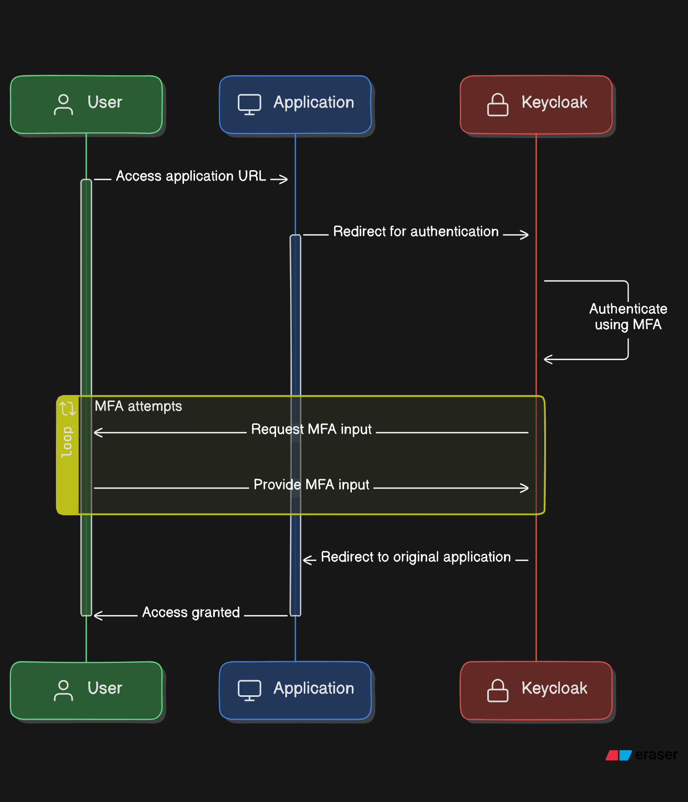

# keycloak-mfa

This repository provides a Dockerized setup for running Keycloak, enhanced with plugins to enable Email and SMS functionalities as part of Multi-Factor Authentication (MFA). 



For more details, read the blog at [Mastering Multi-Factor Authentication in Keycloak: SMS, Email, and TOTP](https://medium.com/@shreyasmk.mathur/mastering-multi-factor-authentication-in-keycloak-sms-email-and-totp-setup-guide-957305b92be1)


# Prerequisites 

Make sure docker installed in your system

## Running / Development

<p>Create and Configure .env File<p>

Create a .env file in the root directory and fill in the following details

```

PG_DB=your_postgres_db
PG_USER=your_postgres_user
PG_PASSWORD=your_postgres_password
KEYCLOAK_ADMIN=your_keycloak_admin
KEYCLOAK_ADMIN_PASSWORD=your_keycloak_admin_password

```

<p> Start Keycloak with Docker<p> 

```

docker compose up

```


